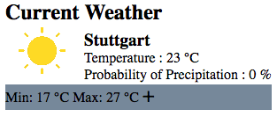

.. ==================================================
.. FOR YOUR INFORMATION
.. --------------------------------------------------
.. -*- coding: utf-8 -*- with BOM.

.. include:: ../Includes.txt

.. _introduction:

Introduction
============
Releases
--------
Currently the source code is available at `Github <https://github.com/jweiland-net/weather2>`_

.. _what-it-does:

What does it do?
----------------

This extension is mainly used to display weather data received from openweathermap.org. The extension however
is designed to work with every weather api by creating an own scheduler and map values to the database structure.
Moreover it is possible to organize records using storage pages and a custom identifier for each record.

.. _screenshots:

Screenshots
-----------
Displaying basic information
^^^^^^^^^^^^^^^^^^^^^^^^^^^^

Displaying more information
^^^^^^^^^^^^^^^^^^^^^^^^^^^
.. figure:: ../Images/FrontendViewExtended.gif
   :alt: Extended frontend view