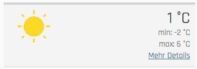
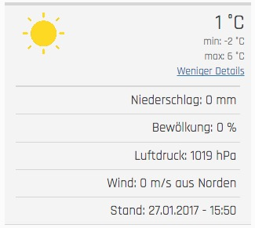
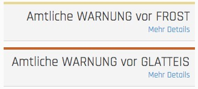

..  include:: /Includes.rst.txt

..  _introduction:

============
Introduction
============

Releases
========

Currently the source code is available at `Github <https://github.com/jweiland-net/weather2>`_

..  _what-it-does:

What does it do?
================

This extension is mainly used to display weather data received from openweathermap.org and weather alerts received from
Deutscher Wetterdienst. The extension however is designed to work with every weather api by creating your own scheduler
and map values to the existing database structure. Moreover it is possible to organize records using storage pages and
a custom identifier for each record.

..  _screenshots:

Screenshots current weather
===========================

Displaying basic information
----------------------------

Displaying more information
---------------------------

Screenshots weather alert
=========================

Display basic information
-------------------------

Display more information
------------------------

..  figure:: ../Images/WeatherAlert/FrontendViewExpanded.jpeg
    :alt: Expanded frontend view
