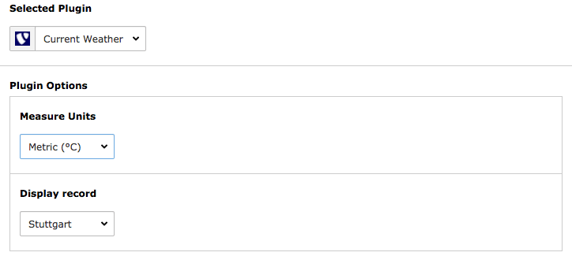
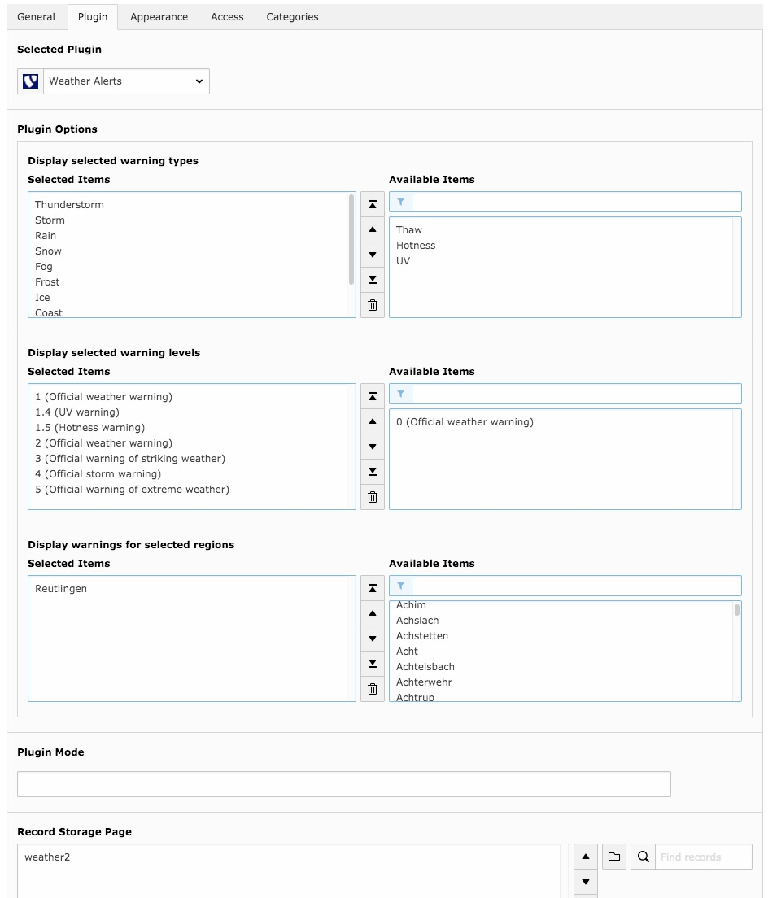

.. ==================================================
.. FOR YOUR INFORMATION
.. --------------------------------------------------
.. -*- coding: utf-8 -*- with BOM.

.. include:: ../Includes.txt

.. _user-manual:

Users Manual
============

Adding a new plugin to display weather reports
^^^^^^^^^^^^^^^^^^^^^^^^^^^^^^^^^^^^^^^^^^^^^^

To add a new plugin just create a new content element, choose insert plugin and select *Current Weather* under plugin.
Now you can select the desired measure unit and record identifier to display records.

Adding a new plugin to display weather alerts
^^^^^^^^^^^^^^^^^^^^^^^^^^^^^^^^^^^^^^^^^^^^^

To add a new plugin just create a new content element, choose insert plugin and select *Weather Alerts* as plugin.
Now you can select which regions, alarm level and alarm types should be displayed. Additionally you can select the
record storage page.

