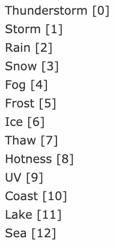
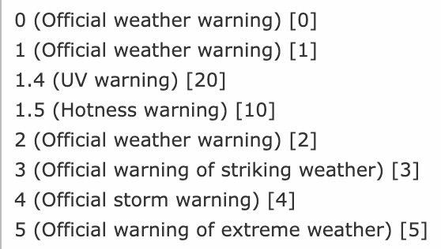

..  include:: /Includes.rst.txt

..  _user-manual:

============
Users Manual
============

Adding a new plugin to display weather reports
==============================================

To add a new plugin just create a new content element, choose insert plugin and select *Current Weather* under plugin.
Now you can select the desired measure unit and record identifier to display records.

..  figure:: ../Images/CurrentWeather/BackendPluginContentElement.gif
    :width: 725px
    :alt: Backend plugin content element

Adding a new plugin to display weather alerts
=============================================

To add a new plugin just create a new content element, choose insert plugin and select *Weather Alerts* as plugin.
Now you can select which regions, alarm level and alarm types should be displayed. Additionally you can select the
record storage page.

..  figure:: ../Images/WeatherAlert/PluginConfiguration.jpeg
    :width: 725px
    :alt: Backend plugin content element

Render weather reports and alerts inside a fluid template
=========================================================

Maybe you want to include the plugins inside a fluid template without a plugin.
Important: Include the static template of weather2 inside the root page.

Render weather reports inside a fluid template
-----------------------------------------------

Add the following TypoScript to your setup:

..  code-block:: typoscript

    # weather reports
    lib.weather2_currentweather = USER
    lib.weather2_currentweather {
      userFunc = TYPO3\CMS\Extbase\Core\Bootstrap->run
      extensionName = Weather2
      pluginName = Currentweather
      vendorName = JWeiland

      settings =< plugin.tx_weather2.settings
      persistence =< plugin.tx_weather2.persistence
      view =< plugin.tx_weather2.view

      # override the settings in here or change them in plugin.tx_weather2
      settings {
        # possible values: Metric | Imperial | Isou
        measureUnits = Metric
        # possible values: The "name" of your report records defined in scheduler task
        selection = Reutlingen
      }
    }

Use the following snippet in your Fluid template:

..  code-block:: html

    <f:cObject typoscriptObjectPath="lib.weather2_currentweather" />

Render weather alerts inside a fluid template
---------------------------------------------

Add the following TypoScript to your setup:

..  code-block:: typoscript

    # weather alerts
    lib.weather2_weatheralert = USER
    lib.weather2_weatheralert {
      userFunc = TYPO3\CMS\Extbase\Core\Bootstrap->run
      extensionName = Weather2
      pluginName = Weatheralert
      vendorName = JWeiland

      settings =< plugin.tx_weather2.settings
      persistence =< plugin.tx_weather2.persistence
      view =< plugin.tx_weather2.view

      # override the settings in here or change them in plugin.tx_weather2
      settings {
        warningTypes = 0,1,2,3,4,5,6,7,8,9,10,11,12
        warningLevels = 0,1,2,3,4,5,10,20
        # warnCells = <uid of your warn cell record> (multiple comma separated)
        warnCells = 215
        showPreliminaryInformation = 1
      }
    }

    Warning types

    Warning levels

Use the following snippet in your Fluid template:

..  code-block:: html

    <f:cObject typoscriptObjectPath="lib.weather2_weatheralert" />
